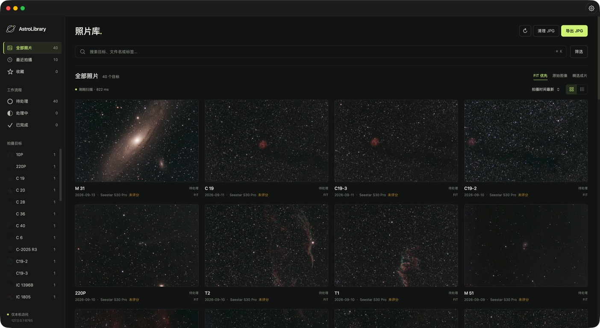

# AstroLibrary

AstroLibrary 是一款面向天文摄影的 macOS 本地图库应用，提供 FIT/FITS 预览、拍摄素材管理和后期成果浏览。照片按拍摄目标组织，可结合评分、标签和处理进度整理观测记录。

项目提供 macOS App 和命令行工具两种使用方式，支持 Seestar 素材导入与 Cloudflare R2 预览同步。



## 功能

- **FITS 预览**：支持灰度、RGB 和 Bayer 图像，提供智能预览、自动拉伸、黑场、亮度与背景中和调节。
- **图库管理**：按目标、日期、设备、标签和评分筛选照片，支持目标合并、收藏和后期进度记录。
- **拍摄素材**：成片与 SUB 单帧分组浏览，可在目标详情中查看不同日期和设备的拍摄记录。
- **精选成片**：使用独立目录管理处理后的 JPG、PNG 和 TIFF，支持脱离原始图库单独浏览。
- **解析缓存**：使用内存与磁盘缓存加快重复浏览，支持自定义缓存位置、清空和重建。
- **导入与导出**：从 Seestar 下载目录增量导入素材，或将图库复制到独立的副本目录。
- **文件清理**：支持 JPG 批量清理、目标素材清理和 Seestar 已导入文件核对，清理文件移入 macOS 废纸篓。
- **R2 同步**：将移除元数据的 JPEG 预览同步到 Cloudflare R2。

## macOS App

运行环境为 **macOS 14 及以上**，从源码构建需要完整 Xcode。App 使用 SwiftUI / WebKit 界面与 C++17 后端。

在项目目录执行：

```bash
./script/build_and_run.sh
```

构建完成后自动打开 App。按 `⌘,` 进入设置，在“通用”中选择图库目录并保存，即可开始浏览。Seestar 导入和精选成片目录可分别配置。

打包安装文件：

```bash
./script/build_and_run.sh --package
```

产物位于 `dist/AstroLibrary.app` 和 `dist/AstroLibrary.dmg`。构建脚本默认采用 ad hoc 签名，签名与分发配置见[开发文档](docs/DEVELOPMENT.md)。

## 命令行工具

CLI 构建需要 Xcode Command Line Tools 或 Xcode：

```bash
./script/build_native.sh

# 打开指定图库
./build/native/astrolibrary serve --library "/path/to/gallery" --open-browser

# 预览导出范围
./build/native/astrolibrary export -s "/path/to/gallery" -d "/path/to/export" --dry-run

# 配置浏览器访问账号
./build/native/astrolibrary auth --username admin
```

App 和 CLI 共用本地配置，本地服务默认地址为 `http://127.0.0.1:8765`。完整参数可通过 `--help` 查看。

## 文档

- [用户指南](docs/USER_GUIDE.md)：图库设置、预览、筛片、导入导出与文件清理。
- [开发与打包](docs/DEVELOPMENT.md)：项目结构、构建、测试与接口约定。
- [配置与安全](docs/SECURITY.md)：本地访问、账号保护与 R2 凭据管理。
- [性能记录](docs/PERFORMANCE.md)：测量结果与复测方法。
- [发布检查](docs/PUBLISHING.md)：源码收录、敏感信息与 Git 历史检查。