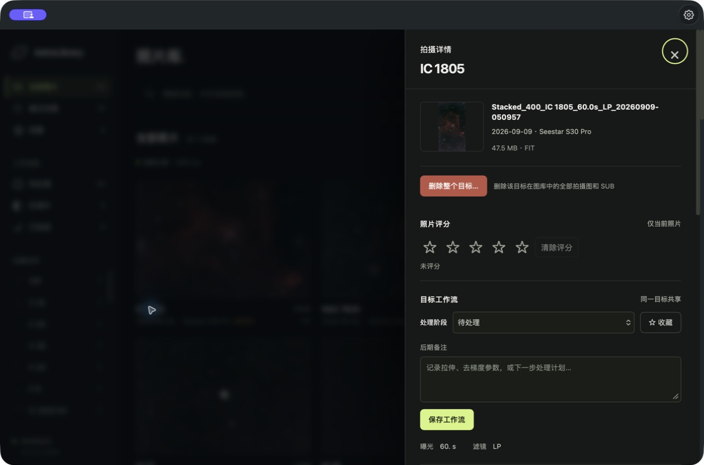
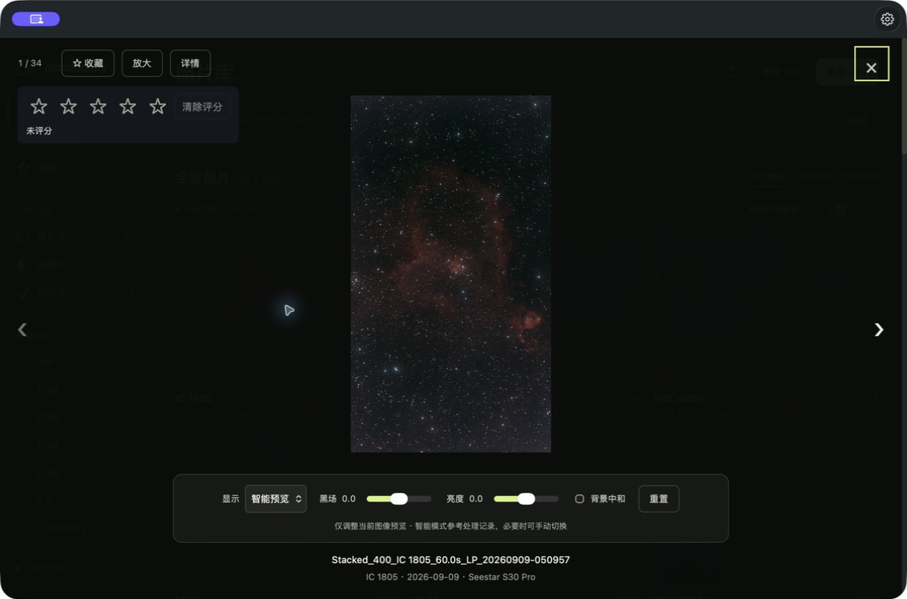

# 用户指南

## 1. 图库目录与可选导入

图库目录是 AstroLibrary 展示和管理的照片位置，由你自行选择。支持任意文件夹名称、根目录直接放照片以及多层子目录，不要求 `MyWorks`。可以使用内置磁盘、已挂载的外置硬盘或 NAS 目录。

1. 在 App 中按 `⌘,` 打开“通用”设置（CLI 浏览器模式可使用网页设置）。
2. 点击“图库目录”旁的“选择…”，选择实际存放照片的文件夹，然后保存。
3. App 扫描该目录及子目录。切换不会搬动照片；预览、JPG 清理和缓存重建均以当前图库为准。

首次使用不再自动将 Seestar 缓存作为图库。未配置时显示 `~/Pictures/AstroLibrary`，请用目录选择器选择或新建文件夹。升级保留原先展示的路径，不自动迁移照片；如果原先的“导出目录”才是你要管理的位置，可以直接把它选为图库。即使与导出设置相同也能保存，实际导出副本时才要求使用独立目录。

**Seestar 导入是可选功能**，在“Seestar 导入”设置页单独配置：

1. 点击“自动查找”发现 Seestar App 已下载的作品目录，或手动选择导入来源。自动查找只提供候选项，不改变图库。
2. 确认“导入到图库”显示的是自己的图库位置，点击“导入到图库”。
3. 后台复制照片和 FIT/FITS，包含 SUB，保留相对子目录；同名文件跳过，原文件及已有照片保留。页面显示新增、跳过数量和失败原因，完成后刷新图库。

导入完成后，可在同一设置页的“清理 Seestar 已导入文件”中点击“检查可清理文件”。后台逐字节核对 Seestar 下载目录与**当前图库**中相同相对路径的副本，包含 FIT/FITS、JPG、PNG、TIF 和 SUB。此核对需要读取两边文件，机械硬盘可能耗时较长，可以随时停止。

检查完成后显示两边目录、可清理数量和大小；点击“清理已导入文件…”并确认后，只将已核对的 Seestar 原文件移入 macOS 废纸篓。没有副本、内容不同、符号链接、检查后发生变化的文件会保留。不会删除图库副本、空目录或 Seestar 的数据库；Seestar App 可能仍显示原下载记录。结果有效期为 10 分钟，重启 App 后需重新检查。清理中点击“停止”会在当前一批完成后停下，已移入废纸篓的文件不会自动恢复。

如果升级前直接把 Seestar 下载目录当作图库，请先选一个独立图库并导入照片，才可使用清理。导入、导出和清理互斥；核对或清理期间不能切换这两个目录。

图库和导入目录不能相同或互相包含；导入期间不能切换这两个目录。退出 App 会中止导入，再次导入可继续补齐文件。没有安装 Seestar 也能正常浏览图库。

若 macOS 阻止读取图库，请用系统目录选择器重新选中该文件夹；仍被阻止时再检查系统隐私设置中的文件访问权限。

从 AstroShelf 升级后，AstroLibrary 会迁移旧设置，但新的 Bundle ID 可能触发 macOS 再次请求文件夹访问权限；按上述步骤重新选择一次即可。

## 2. 画廊与筛选

画廊上方会显示最近一次扫描状态。普通打开会复用短期缓存，点击右上角刷新按钮会立即重新扫描图库目录。

“合并重复目标”开启时，每个目标只显示一张代表图；默认按 FIT 优先选择，再在同类中选择较新成片。点击卡片的目标名称可查看该目标的全部单张成片，关闭合并后逐张展示。

画廊默认展示每个目标的优选图像，FIT/FITS 优先。`_sub` 逐帧仍在目标详情中浏览，支持 FIT 预览。

目标目录如果采用“目标编号 - 描述”命名，画廊默认会按编号合并展示，例如 `NGC 6960 - 西面纱星云` 会显示为 `NGC 6960`。筛选栏中的“合并重复目标”开关关闭后，会按原始目标文件夹分别展示；真实文件夹路径始终保留不变。

“展示”可以切换：

- **FIT 优先**：每个目标优先展示 FIT/FITS，没有 FIT 时依次回退到精选成片、普通图片。日期、设备和搜索筛选先执行，再选择版本。
- **原始图像**：展示图库目录中的 FIT/FITS 和 JPG/PNG/TIFF，优先 FIT。同级版本优选最新拍摄；关闭合并后可查看多个版本。
- **精选成片**：只展示独立精选目录中的处理结果。

筛选器支持目标、设备、自定义标签和拍摄日期区间；排序支持拍摄时间、目标和设备。

## 3. SUB 集合

带有 `_sub` 的目录不会出现在主画廊。点击目标卡片名称打开详情后，应用会按 FITS 头中的 `DATE-OBS`、`CREATOR`/`TELESCOP` 进行日期和设备归档；缺少 FITS 信息时，会回退到文件名时间或修改时间。

每个 SUB 集合旁的“在访达中打开”按钮会直接打开对应的 `_sub` 文件夹。该按钮只允许打开当前图库目录下的 SUB 文件夹。

## 4. 标签和分组



### 照片评分

在照片详情或大图预览中点击 1–5 星即时保存，点击“清除评分”恢复未评分。评分只属于当前照片，FIT、JPG 和修图版本分别保存；不会写入或修改原始图像。不同图库中相同相对路径的照片不会串分。评分存入本机 `catalog.json`，重启 App 后保留；移动或重命名照片后不会自动迁移评分。

在顶部“筛选 → 评分”中选择“未评分”或最低星级；筛选在 FIT 优选和目标合并之前执行，确保高分版本能被找到。“排序”支持评分从高到低或从低到高，未评分始终排在最后。同分时以 FIT 优先、较新拍摄时间排序。

显式按评分排序时，评分优先于文件类型；开启目标合并时，降序选择目标最高分照片，升序选择最低的已评分照片。默认的拍摄时间排序仍保留 FIT 优先。筛选和排序选择仅在当前页面有效。

在目标详情的“标签 / 分组”区域添加标签，例如：

```text
最爱、窄带、待发布、需要重修
```

添加后，标签会出现在画廊筛选器中。标签按目标保存，不会修改原始照片。

## 5. 精选成片目录

在 macOS App 的 **设置 → 通用 → 精选成片目录** 点击“选择…”，可选任意已有文件夹，也可在系统选择器中新建目录，最后点击“保存设置”。网页端的本地设置也有同一入口。把处理并挑选好的 JPG/PNG/TIFF 输出到这个目录，然后在图库顶部选择 **精选成片** 单独浏览；也可将它设为默认照片版本。

推荐目录结构：

```text
精选成片/
├── M 42/
│   └── M42_final.jpg
└── NGC 7293/
    └── ngc7293_edit.jpg
```

此目录独立于原始图库；即使存放 FIT/SUB 的磁盘离线，也能浏览精选图片。存在原始目标时按目录或文件名关联；未匹配到原始目标时，以子目录名作为目标，根目录图片以文件名作为目标。支持原有评分、标签和筛选。开启“合并重复目标”时，每个目标显示一个代表版本，关闭后显示所有图片。

该入口沿用原“修图成果目录”的配置，已有路径继续使用，不会自动复制、移动或覆盖照片。精选目录不是“收藏”标记：目录决定哪些完成图片在这里展示，收藏仍是目标的工作流标记。建议把精选目录放在原始图库之外，避免原始图库清理操作包含它。

## 6. 导出设置

在本地设置中可以指定导出目标目录和导出范围：

- **全部文件（含 SUB）**：默认，导出单张成片和 `_sub` 文件。
- **仅单张成片（不含 SUB）**：跳过所有 `_sub` 子目录。

导出是增量操作：如果目标目录中已经存在相对路径相同的文件，二次导出会跳过它，不会覆盖。App 没有覆盖按钮；需要明确覆盖时，请使用 `./build/native/astrolibrary export --overwrite`。

默认使用已配置的图库与导出目录；尚未配置时分别为 `~/Pictures/AstroLibrary` 和 `~/Pictures/Seestar导出/MyWorks`。两端不能相同或互相包含。导出保留目标目录层级，不受当前画廊筛选影响，也不复制图库外的精选目录。

CLI 常用参数：

```bash
# 先检查范围，再增量导出；默认包含 FIT 和 SUB
./build/native/astrolibrary export --dry-run
./build/native/astrolibrary export

# 只导出可直接查看的图片，或跳过 SUB；两项可组合
./build/native/astrolibrary export --jpg-only
./build/native/astrolibrary export --single-only

# 指定两端目录
./build/native/astrolibrary export \
  --source "/path/to/图库" --destination "/path/to/副本"

# 明确允许覆盖已有副本；--quiet 可减少输出
./build/native/astrolibrary export --overwrite --quiet
```

导出不会跟随指向图库外部的符号链接。`--overwrite` 会覆盖已有副本，使用前先运行 `--dry-run`。App 顶部“导出 JPG”只复制图片，设置中的“导出图库文件”同时包含 FITS。

## 7. Cloudflare R2 预览同步

在“应用设置 → Cloudflare R2 预览同步”中填写 Cloudflare R2 的 S3 凭据：

- `Account ID`
- `Bucket`
- `Access Key ID`
- `Secret Access Key`
- 可选的公开访问地址，例如绑定到存储桶的自定义域名
- 对象前缀，默认是 `astrolibrary/previews`

建议在 Cloudflare 中创建只限定到目标存储桶的 Object Read & Write 凭据。点击“测试连接”会对存储桶执行签名的连接检查；点击“立即同步”会先保存配置，再启动后台同步。

同步只处理主图库的单张成片和精选成片。每个源文件会生成最长边 1600 px、质量 82 的 JPEG，移除 EXIF、GPS、XMP、IPTC 和注释元数据后上传。以下内容不会上传：

- FIT/FITS
- `_sub` 目录中的逐帧文件
- 未降采样的原始照片

同步采用源文件大小、修改时间和预览参数生成指纹；未变化的项目会跳过。每张成功上传后都会立即更新本地映射：

```text
~/Library/Application Support/AstroLibrary/r2-mappings.json
```

上传用的 JPEG 在内存中生成，不单独保存为本地预览文件。

映射记录包括图片 ID、`r2://bucket/object-key`、可选公开 URI、ETag 和上传时间。R2 存储桶默认不是公开图库；需要直接在浏览器打开预览时，请先在 Cloudflare 为存储桶配置公开域名，再把该 HTTPS 根地址填入“公开访问地址”。移除本地配置或映射不会删除 R2 上已经上传的对象。

## 8. 账号保护

网页端只负责登录和退出，账号密码不在网页中设置。macOS App 用户请在 `⌘, → 安全` 中配置；CLI 用户可运行 `./build/native/astrolibrary auth --username admin`。具体安全边界见[配置与安全](SECURITY.md)。


## 9. 收藏、后期进度和快捷键

点击照片右上角的星标收藏整个目标。左侧“收藏”和“工作流程”可以分别查看待处理、处理中、已完成的目标。在目标详情中修改阶段、填写后期备注并点击“保存工作流”。导入精选成片不会自动修改处理阶段。

收藏、阶段、备注和标签一起保存在本机 `catalog.json`；同一目标的别名共享这些信息，源文件不变。搜索框可以搜索目标、文件名、标签及后期备注。筛选条件显示在照片上方，“清除筛选”同时清空搜索关键词、日期、设备、标签和当前工作流。

点击照片进入预览：左右方向键切换当前结果中的照片，`F` 切换收藏，放大按钮切换放大/适应屏幕，`Esc` 关闭最上层面板。`⌘ K`（Windows/Linux 为 `Ctrl K`）聚焦主图库搜索。缩略图为居中裁切，预览显示完整画面。

## FIT/FITS 预览与 JPG 清理



FIT 预览按需生成，最长边 960 px，支持标准 8/16/32/64 位整数、32/64 位浮点、二维灰度、三通道平面 RGB 及常见 Bayer 排列。智能预览会参考 FIT 中的拉伸历史，避免对已处理成品重复提亮；没有处理记录时，根据背景亮度保守判断。自动拉伸通过背景中位数和 MAD 噪声估计确定黑场与中间调，不再把最亮的 0.5% 强制截成白色。详情中可下载原始 FIT；原始科学数据不会被改写。压缩 FITS 和多帧数据立方体暂不支持，损坏文件会显示预览失败提示。

点击图库顶部“清理 JPG”，查看当前已保存的图库目录、JPG/JPEG 数量和大小，然后点击“移入废纸篓”。范围包含所有子目录和 SUB，不受当前目标筛选或导出范围影响；不会跟随符号链接。FIT、PNG、TIFF 等其他文件保留。精选成片或导出文件只有实际位于该图库目录内时才属于此范围。

确认后只处理预览时列出的文件；期间新增文件不处理，已修改或消失的文件会跳过。更换图库目录或预览超过 10 分钟须重新确认。完成后显示成功、跳过、失败数量并重新扫描；可在 macOS 废纸篓中找回文件。

点击 FIT 缩略图打开大图，下方提供：

- **智能预览**：默认模式，有明确拉伸记录或背景已经较亮时保留线性显示；其他图像使用自适应拉伸。
- **原样显示**：关闭自动提亮，按数值范围作线性显示，适合已处理成品。浮点 0–1 与相机整数范围保持原有亮度；任意物理单位采用线性范围映射。
- **自动拉伸**：手动要求自适应拉伸，用于智能判断不符合预期时。
- **黑场 / 亮度**：黑场增大压低背景，减小保留暗部；亮度调整中间调。滑块松开后更新图像。
- **背景中和**：可选，仅在预览中减少背景偏色，默认关闭，以保留已有色彩校准。
- **重置**：恢复当前图像的智能预览和默认参数。

调节按图像隔离，并同步到当前页面的图库、详情和 SUB 缩略图；重新加载页面后恢复默认。FITS 没有统一的“已拉伸”标记，智能判断不能保证识别所有软件的成品，必要时请选择“原样显示”。

## FIT 本地解析缓存

FIT 使用内存与持久化磁盘两层缓存，磁盘缓存默认保存在本机用户目录 `~/Library/Caches/AstroLibrary/fits/`，也可在 App 中更改位置。缓存内容包括 FITS 头信息、解码后的预览像素和不同显示参数的 PNG：

- 再次查看同一图像直接复用 PNG；关闭并重启 App 后仍可复用。
- 改变亮度、黑场或显示模式时，可读取缓存的预览像素，不必重新读取原 FIT。
- 重新扫描仍检查目录和文件属性，但未变化的 FIT 头信息不再重复打开读取。
- 文件路径、设备、文件标识、大小或修改时间变化后自动失效；解码/显示算法版本变化也会分别更新缓存。
- 首次解码按图像通道、行的文件顺序取样，减少机械硬盘跳读。首次读取仍需等待硬盘。

缓存默认限制在约 2 GB，空间不足时淘汰较久未使用的内容；内存中的 PNG 和解码像素另分别限制在 32 MiB、48 MiB。缓存被系统清理后会重新生成；缓存位置不可写或不可用时自动回退到直接解析，原始 FIT 不受影响。浏览器通过 ETag 验证未变化的预览；账号保护开启时仍遵守不保留浏览器缓存的策略。

在 macOS App 中打开 **设置（⌘,）→ 缓存**：

- **缓存目录**：点击“选择…”或输入已有目录的绝对路径，再点击“保存缓存目录”。建议选择内置 SSD 上的位置，以减少机械硬盘读取。App 会在所选目录内创建 `AstroLibrary-FIT-Cache` 专用文件夹，并显示实际使用路径。保存前检查目录和缓存库可写性，成功后立即生效且下次启动沿用；保存失败继续使用原位置。
- **恢复默认目录**：立即切回 `~/Library/Caches/AstroLibrary/fits/`。切换不会搬运或删除旧位置的磁盘缓存，切回时可直接复用；清空和重建仅作用于当前缓存位置。每个位置各自受约 2 GB 限额约束，旧目录仍可能占用磁盘空间。缓存任务运行期间需先停止任务再切换。
- **清空 FIT 缓存**：删除 App 的内存缓存和本机 FIT 缓存库中的记录，释放空间；下次查看时按需生成。显示中的照片不受影响。
- **重建 FIT 缓存**：先清空，再扫描当前已保存的图库目录，为成片 FIT/FITS 重新生成头信息、预览像素和默认智能预览，跳过 SUB 目录。SUB 图片打开时仍按需解析并缓存。修图目录和导出目录不单独参与。
- **停止缓存任务**：当前文件结束后停止，保留已经生成的缓存。关闭设置页不影响后台任务；退出 App 会终止未完成任务。

页面显示缓存占用、容量上限、当前文件、进度及失败数量/最近失败原因。重建时原照片只读；成功切换图库目录后，会自动停止原目录的任务并为新图库建立成片缓存，跳过 SUB 目录；连续切换只处理最后选择的图库。自动任务复用有效缓存，只补齐缺失或变化的文件，不先清空旧缓存，切回原图库可继续复用。保存同一图库、修改其他设置或保存失败不会触发。离线目录显示失败原因，连接磁盘后可手动重建。重建整个大图库可能需要较长时间，超过 2 GB 容量时仍会按缓存策略淘汰旧记录，因此不保证所有图像同时驻留。

磁盘缓存可以跨 App 重启复用，内存缓存只在当前进程内有效。若自选磁盘未连接，App 显示缓存不可用并继续按需解析；不会在缺失的磁盘路径下重新创建所选目录，可连接磁盘或恢复默认位置。


## 删除整个目标

在目标详情页点击“删除整个目标…”。后台统计当前图库内该目标的全部拍摄图与 SUB（含 FIT/FITS、JPG、PNG、TIFF），确认框显示图库路径、拍摄图数量、SUB 数量及总大小。范围按当前目标分组确定，不受当前日期、评分或版本筛选影响；启用目标合并时包含合并后的别名目录。

确认“移入废纸篓”后后台分批处理，支持停止，结束后刷新图库。只有预览中未发生变化的普通文件会被处理；新增文件、符号链接和其他目标保留。预览有效期 10 分钟，切换图库或分组方式后需重新统计。图库外的精选成片、Seestar 下载源、云端文件及工作流记录不在删除范围内，空目录保留。文件可从 macOS 废纸篓恢复。本操作不要求存在备份，请确认后再执行。
